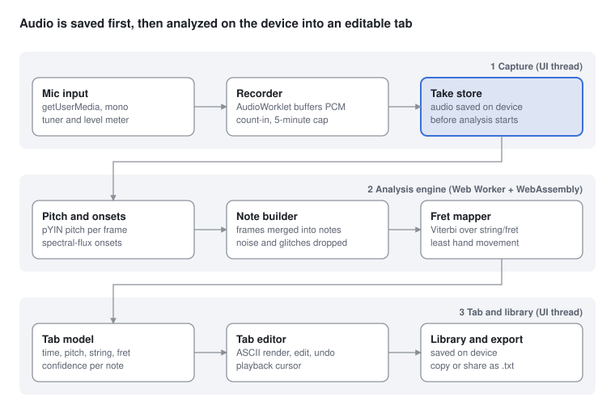

# TabCreator — Requirements

Sep 26, 2026 · Chris Knight

TabCreator records single-note guitar playing through the device microphone and turns it into editable ASCII tablature, entirely on the device. v1 ships as a browser-based web app for laptops and desktops, for standard-tuned 6-string guitar, with chord detection deferred to a later phase.

## Scope and decisions

v1 is record-then-analyze: the player records a take, stops, and gets a tab they can correct and save. Nothing leaves the device.

| Area | v1 decision | Later phase |
| --- | --- | --- |
| Platform | Web app in desktop browsers (Chrome, Edge, Safari, Firefox), installable as a PWA | Desktop wrapper if demand exists |
| Playing style | Single notes (monophonic): melodies, riffs, solos | Chords and double-stops (polyphonic) |
| Timing | Analyze after recording stops | Live preview while playing |
| Instrument | 6-string guitar, standard tuning (E A D G B E), no capo | Alternate tunings, capo, 7-string, bass |
| String/fret choice | Automatic, optimized for playability; user can override | Hand-position hint ("I'm at fret 5") |
| Output | ASCII tab, editable in the app | Rhythm notation, Guitar Pro / MusicXML export |
| Storage | In the browser only; no accounts, no server | Optional cloud sync |

**Out of scope for v1:** chord recognition, rhythm/duration notation, techniques (bends, slides, hammer-ons), importing audio files, and sharing to other users.

## Users and user journey

The primary user is a guitarist who wants to capture a riff or solo they just played without writing it out by hand. Secondary users are teachers transcribing exercises and students checking what they played.

1. **Tune** — the built-in tuner confirms the guitar is in standard tuning and the mic level is good.
2. **Record** — click Record (or press Space), play, then stop. A count-in and input-level meter are shown.
3. **Analyze** — the app detects notes in the browser and shows progress. Target: under 2 seconds for a 60-second take.
4. **Review** — the tab appears, with playback of the recording and a cursor that follows the notes.
5. **Edit** — click a note to change its fret, move it to another string, delete it, or insert a missed note.
6. **Save and export** — save to the in-browser library; copy the ASCII tab or download it as a .txt file.

## Functional requirements

Priorities use MoSCoW: Must ships in v1, Should is v1 if time allows, Could is a stretch.

| ID | Requirement | Priority |
| --- | --- | --- |
| FR-01 | Request microphone permission with a clear explanation; handle denial gracefully | Must |
| FR-02 | Built-in chromatic tuner for standard tuning, accurate to ±3 cents | Must |
| FR-03 | Input-level meter with clipping and too-quiet warnings before and during recording | Must |
| FR-04 | Record up to 5 minutes per take; start/stop with one click or the Space key | Must |
| FR-05 | Optional metronome count-in (tempo 40–240 BPM) | Should |
| FR-06 | Detect note onsets and pitches (E2 82 Hz to E6 1319 Hz, frets 0–24) from the recording | Must |
| FR-07 | Ignore silence, string noise and pick attacks below a confidence threshold | Must |
| FR-08 | Map each note to a string and fret using the playability algorithm | Must |
| FR-09 | Render the result as 6-line ASCII tab, wrapped to window width | Must |
| FR-10 | Play back the recording with a cursor synced to the tab | Should |
| FR-11 | Edit a note: change fret, move to another string (same pitch), delete, insert; mouse and keyboard | Must |
| FR-12 | Undo and redo for all edits | Must |
| FR-13 | Show low-confidence notes highlighted so the user knows what to check | Should |
| FR-14 | Save takes (audio + tab) to an in-browser library; rename, delete, search | Must |
| FR-15 | Copy tab to clipboard and download as .txt | Must |
| FR-16 | Sensitivity setting (noise gate) for noisy rooms | Should |
| FR-17 | Re-run analysis on a saved recording with different settings | Could |
| FR-18 | Trim the start/end of a recording before analysis | Could |
| FR-19 | Choose the input device when more than one microphone or audio interface is connected | Should |

## Non-functional requirements

| ID | Category | Requirement |
| --- | --- | --- |
| NFR-01 | Accuracy | ≥ 95% of notes detected with correct pitch on clean single-note playing at ≤ 160 BPM sixteenths, acoustic or clean electric, in a quiet room |
| NFR-02 | Accuracy | Octave errors ≤ 2% of detected notes |
| NFR-03 | Accuracy | Default string/fret choice matches a human transcriber's in ≥ 80% of notes on the test set |
| NFR-04 | Performance | Analysis of a 60 s take completes in ≤ 2 s on a 2022 mid-range laptop |
| NFR-05 | Performance | Tab editor responds to a click or keystroke in ≤ 100 ms |
| NFR-06 | Privacy | All audio processing in the browser; no audio, tab or analytics data leaves the machine without explicit opt-in |
| NFR-07 | Offline | Every feature works with no network after first load (installable PWA with offline cache) |
| NFR-08 | Browsers | Last 2 versions of Chrome, Edge, Safari and Firefox on Windows and macOS |
| NFR-09 | Storage | A 5-minute take uses ≤ 5 MB (compressed audio); user can delete audio and keep the tab |
| NFR-10 | Accessibility | WCAG 2.2 AA; full keyboard operation; tab readable by screen readers as a note list; dark mode |
| NFR-11 | Reliability | A recording is never lost if the tab is closed or the browser crashes mid-analysis |
| NFR-12 | Maintainability | Detection engine is a separate module with an automated accuracy test suite in CI |

## Architecture

TabCreator is a single-page web app, and its analysis engine is compiled to WebAssembly and runs inside the browser. There is no backend.



The recording is written to storage before analysis begins, so a closed tab or browser crash never loses a take (NFR-11). Analysis runs in a Web Worker so the UI stays responsive.

| Layer | Recommended choice | Why |
| --- | --- | --- |
| UI | React + TypeScript, installable PWA | Works offline; installs to the desktop without an app store |
| Audio capture | Web Audio API with AudioWorklet; echo cancellation, noise suppression and auto gain turned off | Low-latency raw PCM that the browser has not altered |
| Analysis engine | Rust compiled to WebAssembly, in a Web Worker | Near-native speed; testable outside the browser |
| Pitch model (v1) | pYIN pitch tracking + spectral-flux onset detection | Proven, lightweight, accurate for single notes; no ML model to ship |
| Pitch model (chords phase) | Spotify's open-source Basic Pitch via ONNX Runtime Web | Polyphonic note detection that runs in the browser |
| Storage | IndexedDB for takes and notes; Origin Private File System for audio | Local only, per NFR-06 |

Alternatives considered: a desktop app built with Electron or Tauri (better audio-device control, but needs an installer) and a pure TypeScript engine instead of Rust/WebAssembly (simpler build, but slower analysis).

## Detection pipeline and fret mapping

Audio becomes notes in five steps, then a path-finding pass picks a playable string and fret for each note.

**Audio to notes**

1. **Pre-process** — downmix to mono, resample to 22.05 kHz, high-pass at 70 Hz to remove rumble, normalize level.
2. **Pitch tracking** — pYIN estimates pitch and a voicing probability for every ~10 ms frame, limited to 75–1400 Hz (the guitar's range with margin).
3. **Onset detection** — spectral flux marks where each new note is picked, including repeated notes at the same pitch.
4. **Note building** — frames between onsets are merged into one note: median pitch rounded to the nearest semitone, start time, end time, confidence.
5. **Clean-up** — drop notes shorter than 40 ms or below the confidence threshold; fix octave jumps that disagree with neighbouring notes; flag doubtful notes for review (FR-13).

**Notes to string and fret**

In standard tuning the open strings are E2 (82.4 Hz), A2 (110 Hz), D3 (146.8 Hz), G3 (196 Hz), B3 (246.9 Hz) and E4 (329.6 Hz). Most pitches can be played in 2–5 places, so the mapper treats the choice as a shortest-path problem (Viterbi) across the whole take:

- Each candidate (string, fret) for a note is a state.
- The cost of moving between consecutive states grows with the fret distance of the hand shift, string skips, and stretches beyond 4 frets.
- Small biases prefer frets 0–12 and open strings when the surrounding notes are low on the neck.
- The cheapest path through all notes becomes the default tab.
- When the user moves a note to another string, that choice is locked and the rest of the phrase is re-optimized around it.

Weights for these costs are tuned against the test set in NFR-03.

## Tab format and data model

The tab is always rendered from a structured note list, so edits change data, not text. v1 shows notes in played order with spacing roughly proportional to time; rhythm values come in a later phase.

```
e|-----------------0-3-5-3-0--------|
B|-------------1-3-----------3-1----|
G|-------0-2-4----------------------|
D|---2-4----------------------------|
A|-3--------------------------------|
E|----------------------------------|
```

| Entity | Key fields |
| --- | --- |
| Take | id, title, createdAt, durationMs, audioRef, sampleRate, tuning ("EADGBE"), analysisVersion |
| Note | id, takeId, startMs, endMs, midiPitch, string (1–6), fret (0–24), confidence (0–1), lockedByUser |
| AnalysisSettings | sensitivity, minNoteMs, confidenceThreshold, maxFret |
| Edit | id, takeId, type (fret, string, insert, delete), before, after, timestamp — for undo/redo |

The `.txt` export wraps at 80 characters per line and includes a header with the title, tuning and date. Storing `analysisVersion` lets a later, better engine re-analyze old takes without losing user edits to locked notes.

## Risks and open questions

| Risk | Impact | Mitigation |
| --- | --- | --- |
| Laptop mics pick up room noise, fan hum and speaker bleed | Missed or phantom notes | Level meter, noise gate (FR-16), confidence flags, guidance to record close to the guitar |
| Octave errors on low strings and harmonics | Wrong notes on the E and A strings | pYIN plus neighbour-based octave correction; dedicated test cases |
| Fast legato (hammer-ons, pull-offs) has weak onsets | Notes merged together | Pitch-change onsets in addition to spectral flux |
| Browsers process mic audio differently (echo cancellation, auto gain, sample rate) | Distorted pitch or level on some browsers | Turn off processing in getUserMedia constraints; cross-browser test matrix |
| Browser storage can be cleared by the user or evicted | Saved takes lost | Request persistent storage; offer export of the whole library as a file |
| Polyphonic (chord) phase is much harder | Phase 2 slips | Keep the engine modular; prototype Basic Pitch early |

**Open questions**

- [ ] Is opt-in, anonymous crash reporting acceptable under the privacy promise?
- [ ] Should electric guitar through an audio interface be supported in v1, or microphone only?
- [ ] Accuracy test set: who records it, and how many takes and players are enough?
- [ ] Brand name and trademark check for "TabCreator".
- [ ] Should v1 include a basic rhythm hint (bar lines from the count-in tempo), or pure note order?
