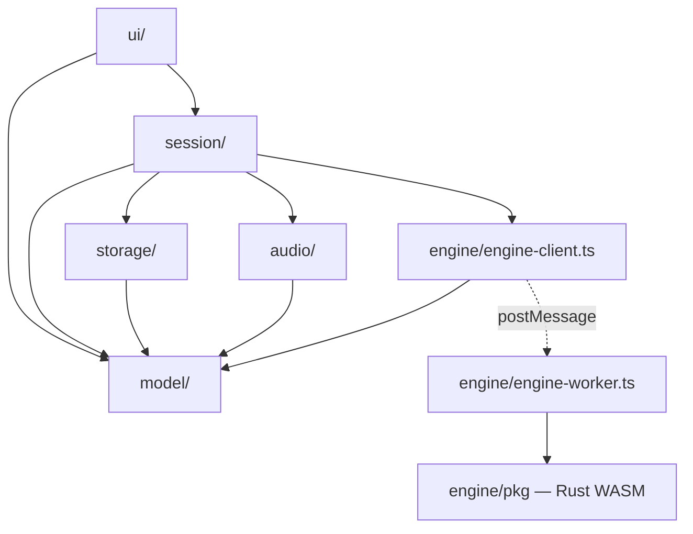
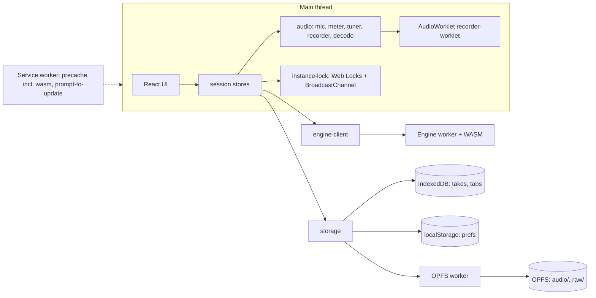
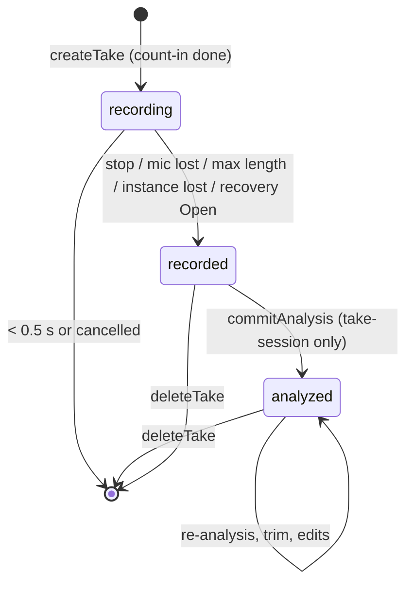
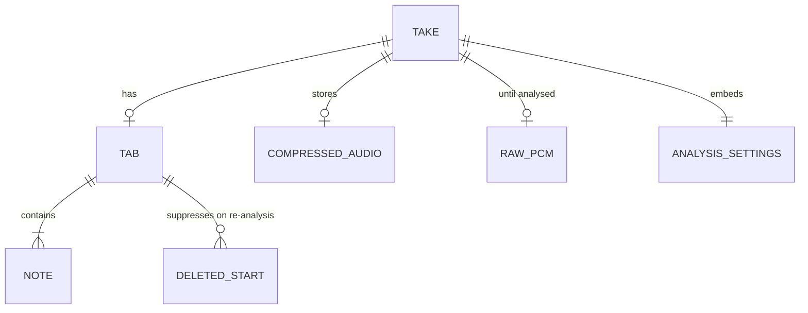
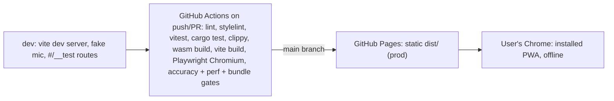

# Architecture Spine — TabCreator v1

The user stories fix file layout, the engine contract, the worker protocol and shared types; this spine fixes the invariants those do not, and overrides them where it says so. On conflict: spec, then this spine, then the stories.

## Design Paradigm

**Functional core / imperative shell.** Pure, deterministic code at the core; everything that touches the browser, the clock, storage or the mic lives in a thin shell around it.

| Layer | Directory | May depend on | Nature |
| --- | --- | --- | --- |
| UI | `app/src/ui/` | session, model | React components, `ui/a11y/`, `ui/platform.ts`, `strings.ts`, `theme.css`; render and dispatch only |
| Session | `app/src/session/` | model, storage, engine client, audio | One store per aggregate, plus `analysis.ts`, `instance-lock.ts`, `app-reload.ts`; owns in-memory state and orchestration |
| Shell adapters | `app/src/audio/`, `app/src/storage/`, `app/src/engine/` | model | The only code touching browser APIs, each for its own API family |
| Model (core) | `app/src/model/` | nothing app-side | Pure TypeScript: types, errors, tab layout, phrase split, edit commands, MIDI math, audio-format table |
| Engine (core) | `engine/src/` | Rust crates only | Pure pipes-and-filters: trim → preprocess → pYIN → onsets → notes; fret map |



## Invariants & Rules

### AD-1 — Dependency direction is enforced [ADOPTED]

- **Binds:** all
- **Prevents:** UI code reaching into storage or wasm directly; model code importing browser APIs; the analysis pipeline being duplicated across layers.
- **Rule:** Imports follow the diagram above and nothing else. `model/` imports no DOM, React, storage or audio, and reads no clock (callers pass `Date.now()` in). `ui/` never imports `storage/`, `audio/` or `engine/`. `engine/` contains only `engine-client.ts`, `engine-worker.ts` and `pkg/`; analysis orchestration lives in `session/analysis.ts` (overriding the stories' `app/src/engine/analyze.ts`). Enforced with ESLint `no-restricted-imports` per directory.

### AD-2 — One owner per browser API family [ADOPTED]

- **Binds:** CAP-1–CAP-9, CAP-16–CAP-19, CAP-26
- **Prevents:** two parallel paths to the same browser API with divergent error handling and lifecycle.
- **Rule:**

| API family | Sole owner |
| --- | --- |
| IndexedDB, OPFS (sync writes only in `storage/opfs-worker.ts`), `navigator.storage.persist/estimate` | `storage/` |
| `localStorage` | `storage/prefs.ts` — one key `tabcreator.prefs.v1` holding a typed `Prefs` (`model/types.ts`) with a versioned migration |
| `getUserMedia`, `enumerateDevices`, `AudioContext`, `AudioWorklet`, `MediaRecorder`, `decodeAudioData` (`audio/decode.ts`) | `audio/` — mic constraints always echoCancellation, noiseSuppression and autoGainControl off |
| wasm module | `engine/engine-worker.ts`; the rest of the app uses `engine/engine-client.ts` |
| Web Locks, `BroadcastChannel` | `session/instance-lock.ts` |
| Clipboard, file download, file picker | `ui/platform.ts` |

### AD-3 — Session stores own in-memory state; storage is the source of truth

- **Binds:** CAP-5, CAP-6, CAP-9–CAP-18, CAP-24, CAP-25
- **Prevents:** two in-memory copies of one Tab or Take drifting, and competing state libraries.
- **Rule:** No state-management library. Each aggregate has exactly one store in `session/`, exposed through `useSyncExternalStore`: `take-session` (one per open take: take, tab, selection, edit history, analysis status), `recording-session` (mic, meter, recorder, count-in, recovery scan), `library-session` (take list, search, backup/restore), `settings-session` (prefs). Screens read state only from these stores. Stores never read each other; they learn of changes only through storage change events (AD-5) and pass facts across screens only by persisting them (AD-14).

### AD-4 — Every tab mutation is a two-phase edit command

- **Binds:** CAP-8, CAP-10, CAP-11, CAP-13, CAP-14, CAP-15
- **Prevents:** edits that bypass undo, a second fret mapper in TypeScript, async edits interleaving, and re-analysis undo leaving Take fields behind.
- **Rule:**
  - The only way to change `Tab.notes`, `Tab.deletedStartMs` or the analysis-owned Take fields is `takeSession.apply(command)`. A command in `model/edit-history.ts` has two pure phases: `plan(state) → EngineRequest[]` and `reduce(state, results) → state`.
  - `apply` runs commands one at a time per take; later commands, undo and redo queue behind a command waiting on the engine, and the UI shows no intermediate state. Each engine request carries the Tab revision it was planned from; a stale result is dropped and the command re-planned.
  - Fret mapping exists only in `engine/src/fretmap.rs`; `model/` contains no string/fret search.
  - Edit + re-fit is one undo step. The first analysis resets history and is not undoable. Re-analysis and trim are commands whose undo snapshot is `{notes, deletedStartMs, settings, trimStartMs, trimEndMs, warnings, analysisVersion}`, restored through `commitAnalysis`.
  - Undo history lives in memory in the `take-session`, at most 200 steps, and is discarded with the session. The resulting Tab is saved with a 300 ms debounced `putTab`.

### AD-5 — Storage publishes change events

- **Binds:** CAP-5, CAP-6, CAP-17, CAP-19
- **Prevents:** screens polling storage, missing takes added by recording, recovery or restore, and a store's own write echoing back over newer edits.
- **Rule:** Every committed write in `storage/` emits one typed event `{type, takeId?, writer}` on an in-process emitter: `take-put`, `take-deleted`, `tab-put`, `library-restored` (with `count`). Events carry ids, never payloads. A store ignores events it wrote. While a `take-session` has a take open it is the authority for that Tab and its own Take fields: it re-reads only fields it does not own (for example `title` after a library rename, `audioMime`) and disposes itself on `take-deleted`.

### AD-6 — Single active app instance [ADOPTED]

- **Binds:** CAP-5, CAP-6, CAP-14, CAP-17, CAP-19, CAP-22
- **Prevents:** two browser tabs recording at once or writing the same take.
- **Rule:**
  - At start the app requests the Web Lock `tabcreator-instance` before any storage write or recovery scan. Web Locks is part of the unsupported-browser check.
  - If another tab holds it, show "TabCreator is open in another tab" with "Use here". "Use here" asks the holder over `BroadcastChannel('tabcreator-instance')` to release, waits up to 3 s, then takes the lock with `steal: true`.
  - The releasing tab (1) stops capture and persists the stop without starting analysis (`stopReason: 'instance-lost'`), (2) cancels its engine requests, (3) flushes all stores (AD-16), (4) closes its IndexedDB connection, (5) releases the lock and shows the same screen. After losing the lock, every `storage/` write in that tab rejects with `instance-taken`.

### AD-7 — The engine is pure and deterministic [ADOPTED]

- **Binds:** CAP-8, CAP-9, CAP-10, CAP-11, CAP-23, CAP-27, CAP-28
- **Prevents:** flaky accuracy benchmarks, trimmed and untrimmed times disagreeing, and old takes silently re-analysing to different results.
- **Rule:**
  - `analyze` and `map_frets` are pure functions of their inputs. `analyze` takes the full untrimmed PCM, its actual sample rate, and `EngineAnalyzeInput` (`model/types.ts`: `AnalysisSettings` + `trimStartMs`, `trimEndMs`, `skipStartMs`). The engine trims, measures `skipStartMs` from untrimmed 0, and returns times relative to untrimmed 0.
  - Output is byte-identical for identical inputs on the same build target; every float in output JSON is rounded (times to 1 ms, confidence and cents to 4 dp).
  - Every tunable lives in `Params::from_settings` or `FretWeights`. DSP crates are pinned to exact versions with `Cargo.lock` committed. Any change to fixture output bumps `engine_version()`, enforced by committed per-fixture output hashes in CI that fail unless the version changed with them.
  - The app stores `engine_version()` as `Take.analysisVersion` and never re-analyses automatically because of a version change.

### AD-8 — One engine worker, prioritised and scoped requests

- **Binds:** CAP-8, CAP-9, CAP-10, CAP-11, CAP-14
- **Prevents:** analyses racing on one take, cancel killing another take's work, edits waiting behind a whole-take analysis, and inconsistent progress scaling.
- **Rule:**
  - `engine-client.ts` owns exactly one module worker, created lazily. Every request carries `takeId`. Requests run one at a time; `mapFrets` requests go ahead of queued `analyze` requests.
  - `cancel(takeId)` removes that take's queued requests and, only if the in-flight request is that take's, terminates and respawns the worker; other queued requests then run in order.
  - Worker errors are `{type:'error', reqId|null, code, message}` with `code` `engine-unavailable` (init failure, sent once with `reqId: null`, after which every request rejects with it) or `analysis-failed`.
  - `analyze` progress is monotone 0..1 over the whole call, weighted preprocess 0–0.111, pYIN to 0.778, onsets to 0.944, notes to 1, throttled to one message per 100 ms. `take-session` maps it to 0–0.9 and `mapFrets` completion to 1.0.

### AD-9 — Recording durability order [ADOPTED]

- **Binds:** CAP-5, CAP-6, CAP-7
- **Prevents:** a crash losing captured audio, and recovery working from incomplete records.
- **Rule:** `createTake` runs when the count-in finishes (or at the click with no count-in) and includes `sampleRate`, `micLabel`, `countInBpm` and `settings`; capture blocks arriving before it resolves are held and appended first. Each 1 s raw PCM chunk is appended through `storage/opfs-worker.ts` before anything else consumes it, so a crash loses at most the last second (NFR-11). Compressed audio (`audio/webm;codecs=opus`, 96 kbps) is the long-term copy. The raw file is deleted only after `commitAnalysis` resolves. Cancelled count-ins create nothing; takes under 0.5 s are deleted at stop.

### AD-10 — Typed errors with a closed code set

- **Binds:** CAP-1, CAP-9, CAP-17, CAP-19, CAP-22, CAP-25, CAP-26
- **Prevents:** each module inventing error shapes, the UI string-matching messages, and technical text reaching users.
- **Rule:** Shell modules reject with `AppError { code, message, cause? }` (`model/errors.ts`). `code` is one of: `mic-denied`, `mic-no-device`, `mic-in-use`, `mic-failed`, `mic-lost`, `storage-full`, `storage-failed`, `take-not-found`, `audio-missing`, `engine-unavailable`, `analysis-failed`, `analysis-cancelled`, `backup-invalid`, `unsupported-browser`, `instance-taken`. Adding a code is an edit to this list. The UI maps codes to `ui/strings.ts`; `message` goes to logs only and is never shown (the analysis-failed banner reads "Analysis failed — try again").

### AD-11 — Persisted shapes are versioned

- **Binds:** CAP-6, CAP-10, CAP-17, CAP-19
- **Prevents:** a later build corrupting or misreading data saved by an earlier one.
- **Rule:** Any change to a persisted shape (IndexedDB stores, OPFS paths, `Prefs`, backup manifest) bumps its version and adds a numbered migration with a fixture test that upgrades a stored v(n−1) record. The backup manifest carries `format`; restore rejects unknown formats with `backup-invalid`. OPFS audio filenames derive their extension only from the MIME table in `model/audio-format.ts`.

### AD-12 — Styling and copy come from single sources

- **Binds:** CAP-12, CAP-13, CAP-21, CAP-25
- **Prevents:** raw colours breaking dark mode or contrast, parallel token naming schemes, and copy drifting from the UX voice.
- **Rule:**
  - `ui/theme.css` is the only file defining colours. Every `DESIGN.md` token becomes one custom property named `--color-<name>`, `--font-<name>` or `--space-<name>`; the `-dark` suffix never appears in CSS. Dark values redefine the same property under `@media (prefers-color-scheme: dark) { :root:not([data-theme="light"]) }` and `:root[data-theme="dark"]`. `main.tsx` sets `data-theme` on `<html>` from prefs before first render. Components never refer to a theme. The PWA manifest's theme colours are generated from the tokens. stylelint forbids colour literals outside `theme.css`.
  - Every user-visible string lives in `ui/strings.ts`: one flat `const strings = { … } as const` with keys `<screen|global>.<camelCase>`, parameterised strings as typed functions. Text matches `EXPERIENCE.md` verbatim where it defines one; new text follows its Voice and Tone.

### AD-13 — Nothing leaves the device [ADOPTED]

- **Binds:** all (NFR-06)
- **Prevents:** a dependency or feature sending audio, tabs, analytics or crash data anywhere, or loading remote assets.
- **Rule:** No cross-origin request of any kind. Same-origin fetches are allowed only for the app's own precached assets (the wasm module, service-worker precache). Every build ships the CSP meta tag `default-src 'self'; script-src 'self' 'wasm-unsafe-eval'; worker-src 'self' blob:; media-src 'self' blob:; connect-src 'self'`; `build.assetsInlineLimit` is 0 and the PWA registers with an external script, so nothing needs inline code or `data:` URLs. Playwright asserts zero CSP violations and zero non-self requests across the core flow. A new dependency that performs network I/O is rejected.

### AD-14 — Take field ownership and patch writes

- **Binds:** CAP-5, CAP-6, CAP-8, CAP-10, CAP-17, CAP-19, CAP-25
- **Prevents:** lost updates from whole-record writes by six different units.
- **Rule:** `storage/db.ts` exposes `createTake(take)` (fails if the id exists), `patchTake(id, patch, writer)`, `commitAnalysis(takeId, tab, takePatch)`, `importTakes(records)`, `putTab(tab)` and `deleteTake(id)`; there is no public `putTake`. `patchTake` merges inside one `readwrite` transaction. Each Take field has one writer, listed in `model/types.ts` as `TAKE_FIELD_OWNERS`:

| Writer | Fields |
| --- | --- |
| `recording-session` (incl. recovery) | `id`, `createdAt`, `micLabel`, `sampleRate`, `countInBpm`, `settings` (copied from prefs `analysisDefaults` at creation, never linked afterwards), `tuning`, `durationMs`, `clipped`, `stopReason`, `audioMime` at stop; `status` `recording → recorded` |
| `take-session` | `title` (Tab screen), `settings` (after creation), `trimStartMs`, `trimEndMs`, `warnings`, `analysisVersion`; `status` `recorded → analyzed` via `commitAnalysis` |
| `library-session` | `title` (rename), `audioMime → null` (delete audio) |
| restore | whole records, through `importTakes` only |

A patch touching a field its writer does not own throws in dev builds. Facts that must survive Record → Tab (clipping, max-length stop) are persisted as `clipped` and `stopReason`; no in-memory or URL handoffs between stores.

### AD-15 — Take lifecycle and analysis ownership

- **Binds:** CAP-5, CAP-6, CAP-8, CAP-9, CAP-10, CAP-17
- **Prevents:** double analysis, false recovery banners, good audio overwritten, and orphaned files or records.
- **Rule:**
  - `take-session` is the only caller of `session/analysis.ts`. `recording-session`'s stop ends when `patchTake({status:'recorded', …})` commits; it then navigates to `#/tab/:takeId` and hands nothing over in memory.
  - `take-session.ensureAnalysed()` starts analysis if and only if the loaded take is `recorded` and no analysis for it is in flight or queued. This also resumes an analysis interrupted by a reload.
  - Analysis PCM comes from `storage.readRaw` while the raw file exists, otherwise from `audio/decode.ts`; it always passes the sample rate of the buffer it has. Results commit through one `commitAnalysis` transaction (Tab + `{status:'analyzed', analysisVersion, warnings}`).
  - The recovery scan runs only after the instance lock is held. A take is **unfinished** if and only if `status === 'recording'`; only those get the recovered-take banner and are rebuilt from raw. Recovery never overwrites existing compressed audio. A raw file with no Take record, or an unfinished take with under 0.5 s of raw audio, is deleted without a banner.
  - `deleteTake` removes the Take and Tab in one transaction, emits `take-deleted`, then removes OPFS files best-effort. The start-up scan deletes OPFS files whose Take does not exist.
  - Re-analyse and Trim are disabled when neither compressed audio nor a raw file exists; if called anyway they reject with `audio-missing`.

### AD-16 — Lifetimes, flush and write fencing

- **Binds:** CAP-6, CAP-14, CAP-17, CAP-20
- **Prevents:** deleted takes coming back from pending writes, lost final edits on navigation or reload, and upgrades hanging on an old connection.
- **Rule:**
  - A `take-session` lives from entering `#/tab/:takeId` until leaving it; on exit it awaits `flush()` before the next screen mounts. Only an in-flight analysis outlives it, writing through the same fenced API. Every store flushes on `pagehide` and `visibilitychange → hidden`.
  - `putTab`, `patchTake` and `commitAnalysis` reject with `take-not-found` if the Take does not exist in the same transaction; only `createTake` and `importTakes` create records. On `take-deleted`, every store holding that take drops its pending writes and calls `engineClient.cancel(takeId)`.
  - `db.ts` handles `versionchange` by flushing, closing its connection and showing the blocked screen; a `blocked` open shows "Close other TabCreator tabs to finish updating".
  - Every app-initiated reload (update prompt, engine Reload) goes through `session/app-reload.ts`, which is unavailable while recording or analysing and awaits `flushAll()` first.

### AD-17 — Performance and bundle budgets are CI gates

- **Binds:** CAP-9, CAP-14, CAP-20, CAP-23 (NFR-04, NFR-05)
- **Prevents:** budgets being checked by hand or silently eroded by one epic.
- **Rule:** CI fails when: initial JS > 200 KB gzipped; `.wasm` > 1 MB gzipped; median analysis of a 60 s take > 2.0 s (calibrated runner, `tools/benchmark.ts`); p95 edit-to-paint on a 500-note tab > 100 ms. The engine is single-threaded (no `SharedArrayBuffer`: GitHub Pages cannot send COOP/COEP headers).

### AD-18 — Accessibility plumbing has one owner each

- **Binds:** CAP-14, CAP-21, CAP-25
- **Prevents:** every screen building its own live region, shortcut handling and dialog focus logic.
- **Rule:** `ui/a11y/announcer.ts` owns the single live region; stores emit announceable events and screens never write their own `aria-live` text. `ui/a11y/shortcuts.ts` is the only keyboard-shortcut registry: every shortcut in `EXPERIENCE.md` is registered there, it applies the text-field guard, and the `?` dialog renders from it. `ui/a11y/overlays.ts` owns overlays: one level deep, focus trapped while open and restored on close.

### AD-19 — PWA update and offline

- **Binds:** CAP-20, CAP-22
- **Prevents:** a missing wasm breaking offline use, and an update reload interrupting a recording or analysis.
- **Rule:** vite-plugin-pwa with `registerType: 'prompt'`; the precache includes the `.wasm`, asserted by the offline e2e test. The update toast is shown only when `recording-session` and every `take-session` report idle, and "Reload" goes through `session/app-reload.ts` (AD-16). The build uses a relative `base: './'`, so service-worker scope, manifest `start_url` and precache URLs work under any path. Installability is verified with Playwright, not Lighthouse.

## Consistency Conventions

| Concern | Convention |
| --- | --- |
| Naming | Files kebab-case (`take-session.ts`); React components PascalCase; stores `<aggregate>-session.ts`; storage events kebab-case (`take-put`); Rust modules snake_case. |
| Ids | `crypto.randomUUID()` for Take and Note ids. Note ids are stable across edits; re-analysis issues new ids except for locked notes. |
| Time & pitch | Integer milliseconds relative to the untrimmed take start; MIDI integers; `StringNo` 1 = high e … 6 = low E; frets 0–24. |
| Dates | Persisted as ISO 8601 UTC strings; display formats are set per surface by `EXPERIENCE.md`. |
| Engine I/O | JSON strings across the wasm boundary only; camelCase keys matching the shared TypeScript types. |
| Errors & logging | `AppError` per AD-10; never throw strings. No `console.*` output in production builds except the worker panic hook; dev diagnostics go through `model/log.ts`, stripped in production. |
| Async | Promises everywhere; long work (analysis, backup zip, waveform) runs off the main thread. |
| Config | No runtime config or env vars in production. Dev-only behaviour (fake mic, `#/__test/*` routes) is gated on `import.meta.env.DEV` and must tree-shake out. |
| Tests | Each module ships with its own Vitest or `cargo test` suite; e2e uses the fake mic and fixtures in `testdata/`; no test reaches the network. |
| Dependencies | A new runtime npm package or Rust crate needs a note in the PR (stories' rule); versions are pinned exactly. |

## Stack

| Name | Version |
| --- | --- |
| Node.js (build only; enforced via `engines` and `.nvmrc`) | 24.21.0 |
| pnpm | 12.6.0 |
| TypeScript (held below 7: typescript-eslint 8.70.1 supports < 6.1; worker files use a separate tsconfig with the WebWorker lib) | 6.0.3 |
| React / react-dom | 19.3.0 |
| @types/react / @types/react-dom | 19.3.0 |
| @types/audioworklet | 0.0.100 |
| Vite | 8.3.1 |
| @vitejs/plugin-react | 6.1.1 |
| vite-plugin-pwa | 1.3.0 |
| idb | 8.0.3 |
| fflate | 0.8.3 |
| Vitest | 5.0.2 |
| jsdom | 30.1.1 |
| @testing-library/react / @testing-library/dom | 16.3.3 / 10.4.2 |
| fake-indexeddb | 6.2.5 |
| @playwright/test | 1.63.0 |
| @axe-core/playwright | 4.13.0 |
| ESLint / @eslint/js / typescript-eslint / eslint-plugin-react-hooks | 10.11.0 / 10.0.1 / 8.70.1 / 7.1.1 |
| stylelint / stylelint-config-standard | 17.15.0 / 40.0.0 |
| Prettier | 3.9.9 |
| Rust (stable; `rustfmt`, `clippy -D warnings`) | 1.98.1 |
| wasm-bindgen | 0.2.129 |
| wasm-pack (wasm-opt run with explicit `--enable-bulk-memory --enable-nontrapping-float-to-int`; CI builds the wasm on every change) | 0.15.0 |
| rustfft | 6.4.1 |
| rubato (pinned `=5.0.0`) | 5.0.0 |
| serde (derive) / serde_json | 1.0.229 / 1.0.151 |
| console_error_panic_hook | 0.1.7 |
| Target browser | Chrome, last 2 stable versions (desktop, Windows and macOS) |

## Structural Seed

Runtime containers — everything runs in one browser origin:



Take lifecycle:



Core entities (fields live in `app/src/model/types.ts`):



Deployment and environments:



Environments are dev, CI and prod only; there are no preview deploys. Rollback is redeploying the previous `dist/`; clients pick it up through the update prompt.

Source tree additions and overrides to the stories' layout:

```text
app/src/
  session/    # take-session, recording-session, library-session, settings-session, analysis, instance-lock, app-reload
  engine/     # engine-client, engine-worker, pkg/ only (analyze.ts moves to session/analysis.ts)
  audio/      # + decode.ts
  model/      # + errors.ts, audio-format.ts, log.ts
  storage/    # + events.ts, prefs.ts
  ui/         # theme.css, strings.ts, platform.ts, a11y/ (announcer, shortcuts, overlays)
```

## Capability → Architecture Map

| Capability | Lives in | Governed by |
| --- | --- | --- |
| CAP-1, CAP-2, CAP-3, CAP-26 mic, devices, meter, input warnings | `audio/mic.ts`, `audio/level-meter.ts`, `session/recording-session.ts` | AD-2, AD-10 |
| CAP-4 tuner | `audio/tuner.ts` (main thread, not the engine) | AD-2 |
| CAP-5, CAP-6, CAP-7 record, recovery, count-in | `audio/recorder*.ts`, `audio/metronome.ts`, `storage/`, `session/recording-session.ts` | AD-6, AD-9, AD-14, AD-15 |
| CAP-8 trim | `session/take-session.ts`, `engine/` | AD-4, AD-7, AD-8 |
| CAP-9, CAP-27, CAP-28 detection, tuning warnings, techniques | `engine/src/*.rs`, `session/analysis.ts` | AD-7, AD-8, AD-15 |
| CAP-10 sensitivity, re-analysis | `session/take-session.ts`, `engine/` | AD-4, AD-7, AD-14 |
| CAP-11 fret mapping, re-fit | `engine/src/fretmap.rs`, `model/phrase.ts`, `model/edit-history.ts` | AD-4, AD-7, AD-8 |
| CAP-12, CAP-13, CAP-24 tab render, flags, bar lines | `model/tab-render.ts`, `ui/screens/Tab` | AD-1, AD-12 |
| CAP-14, CAP-15 edit, undo/redo | `model/edit-history.ts`, `session/take-session.ts` | AD-4, AD-16, AD-17, AD-18 |
| CAP-16 playback | `ui/screens/Tab`, `session/take-session.ts` | AD-3 |
| CAP-17, CAP-18, CAP-19 library, export, backup | `storage/`, `session/library-session.ts`, `model/tab-render.ts`, `ui/platform.ts` | AD-5, AD-11, AD-14, AD-16 |
| CAP-20 offline PWA | `vite-plugin-pwa` config, service worker | AD-13, AD-17, AD-19 |
| CAP-21 accessibility, dark mode | `ui/a11y/`, `ui/theme.css` | AD-12, AD-18 |
| CAP-22 unsupported browser | `app/src/main.tsx` capability check (AudioWorklet, OPFS, WebAssembly, Web Locks) | AD-6, AD-10 |
| CAP-23 benchmarks | `engine/tests/fixtures.rs`, `tools/benchmark.ts`, CI | AD-7, AD-17 |
| CAP-25 error and empty states | all session stores, `ui/` | AD-10, AD-12 |

## Deferred

- **Chord phase engine** (Basic Pitch via ONNX Runtime Web) — later phase; AD-7 and AD-8 isolate the engine behind the client.
- **Cloud sync, accounts, sharing** — out of scope; AD-13 forbids network I/O until a future spine lifts it.
- **Internationalisation** — `ui/strings.ts` is the seam; no locale switching in v1.
- **Mobile and other browsers** — non-goals; the capability check (CAP-22) is the only gate.
- **Component internals and file-level structure inside `ui/`** — owned by the code; `DESIGN.md` and `EXPERIENCE.md` govern the result.
- **Fret-mapping weights and detection thresholds** — tuned against fixtures in the code; AD-7 requires a version bump when they change output.
- **Custom domain** — not needed; the relative base (AD-19) keeps the build host-agnostic.
- **Runtime monitoring and operations** — none by design (AD-13); quality is watched through CI gates (AD-17).
- **Moving to TypeScript 7** — when typescript-eslint supports it; a Stack change only.
