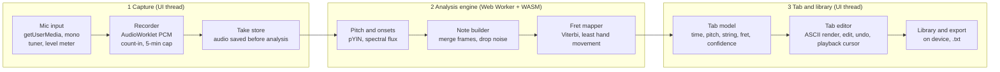

# Architecture diagrams

Source image: `../../../TabCreator-Architecture.svg` (PNG alongside). Audio is saved first, then analyzed on the device into an editable tab.

```mermaid
flowchart LR
  subgraph S1["1 Capture (UI thread)"]
    A[Mic input<br/>getUserMedia, mono<br/>tuner, level meter] --> B[Recorder<br/>AudioWorklet PCM<br/>count-in, 5-min cap] --> C[Take store<br/>audio saved before analysis]
  end
  subgraph S2["2 Analysis engine (Web Worker + WASM)"]
    D[Pitch and onsets<br/>pYIN, spectral flux] --> E[Note builder<br/>merge frames, drop noise] --> F[Fret mapper<br/>Viterbi, least hand movement]
  end
  subgraph S3["3 Tab and library (UI thread)"]
    G[Tab model<br/>time, pitch, string, fret, confidence] --> H[Tab editor<br/>ASCII render, edit, undo, playback cursor] --> I[Library and export<br/>on device, .txt]
  end
  C --> D
  F --> G
```
